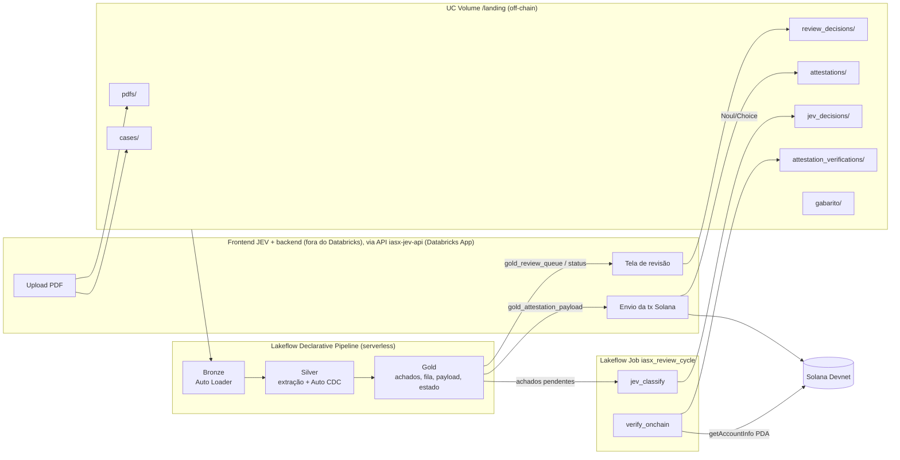

# Arquitetura da stack de dados — IASX Clinical Review

## Visão geral

```mermaid
flowchart LR
  subgraph Portal["Frontend JEV + backend (fora do Databricks), via API iasx-jev-api (Databricks App)"]
    UP[Upload PDF] ; REV[Tela de revisão] ; SOL[Envio da tx Solana]
  end

  subgraph Landing["UC Volume /landing (off-chain)"]
    L1[pdfs/] ; L2[cases/] ; L3[review_decisions/] ; L4[attestations/]
    L5[jev_decisions/] ; L6[attestation_verifications/] ; L7[gabarito/]
  end

  subgraph Pipeline["Lakeflow Declarative Pipeline (serverless)"]
    B[Bronze<br/>Auto Loader] --> S[Silver<br/>extração + Auto CDC] --> G[Gold<br/>achados, fila, payload, estado]
  end

  subgraph Jobs["Lakeflow Job iasx_review_cycle"]
    J1[jev_classify] ; J2[verify_onchain]
  end

  UP --> L1 & L2
  REV --> L3
  SOL --> L4
  Landing --> B
  G -->|achados pendentes| J1 -->|Noul/Choice| L5
  J2 -->|getAccountInfo PDA| CH[(Solana Devnet)]
  J2 --> L6
  SOL --> CH
  G -->|gold_attestation_payload| SOL
  G -->|gold_review_queue / status| REV
```

O **lakehouse é a fonte da verdade off-chain**; a **Solana guarda apenas a prova**. O portal não calcula
hashes: lê o payload pronto em `gold_attestation_payload`, envia a transação e grava o recibo na landing.
A pipeline, então, compara o que está on-chain com o payload recalculado — e só aí a revisão vira `ATTESTED`.

## Camadas

| Camada | Tabela | Tipo | Papel |
|---|---|---|---|
| Bronze | `bronze_documents` | Streaming table (Auto Loader `binaryFile`) | PDF bruto + `input_hash` (sha256). Única tabela com conteúdo original. |
| Bronze | `bronze_cases`, `bronze_jev_decisions`, `bronze_review_decisions`, `bronze_attestations`, `bronze_attestation_verifications` | Streaming tables (Auto Loader JSON) | Feeds de eventos, schema explícito + `_rescued_data`. |
| Bronze | `bronze_gabarito` | Materialized view | Gabarito dos casos sintéticos. |
| Silver | `silver_document_pages` | Streaming table | Texto por página (pypdf), identificadores mascarados, `is_textual`, `parse_error`, `synthetic_declared` (sem a declaração, o texto não é propagado). |
| Silver | `silver_lab_results` | Streaming table | Resultado de exame com fonte: documento, página, linha, offsets, trecho. |
| Silver | `silver_cases`, `silver_jev_decisions`, `silver_review_decisions`, `silver_attestations`, `silver_attestation_verifications` | Streaming tables via **Auto CDC (SCD1)** | Último estado por chave, com expectations. |
| Gold | `gold_timeline` | MV | Linha do tempo. |
| Gold | `gold_temporal_comparison` | MV | Variação entre coletas consecutivas. |
| Gold | `gold_conflicts` | MV | Mesmo exame/data com valores divergentes — sem escolher versão. |
| Gold | `gold_gaps` | MV | Data/valor/unidade/faixa ausentes, valor ilegível ou ambíguo, página sem texto, documento não sintético. |
| Gold | `gold_findings` | MV | Achados consolidados com `finding_id` determinístico. **Falha a atualização se algum achado não tiver fonte.** |
| Gold | `gold_review_queue` | MV | Achado + Jev + regras de segurança + justificativa (`review_reasons`, `priority_reason`) + ação do profissional. |
| Gold | `gold_attestation_payload` | MV | `input_hash`, `analysis_hash`, `reviewed_hash`, versões (`model_version` derivado do extrator e do Jev usados), status alvo. |
| Gold | `gold_review_status` | MV | Máquina de estados + verificação on-chain. |
| Gold | `gold_benchmark`, `gold_mvp_metrics` | MV | Cobertura, precisão de fonte, tempos, taxas. |

## Máquina de estados (`gold_review_status.review_state`)

| Estado | Condição |
|---|---|
| `CREATED` | caso registrado, nenhum PDF |
| `PROCESSING` | PDFs recebidos, achados aguardando o Jev |
| `HUMAN_REVIEW_REQUIRED` | há achado com `needs_review_final` sem ação do profissional |
| `AI_REVIEW_READY` | análise pronta, nada pendente, falta o *signoff* |
| `CONFIRMED` / `CORRECTED` | signoff feito (`CORRECTED` se houve alguma correção) |
| `ATTESTED` | atestação on-chain **verificada** e hashes on-chain = payload recalculado |
| `ATTESTED_EMULATED` | mesma conferência de hashes, mas a atestação veio do emulador da Solana (`cluster = emulated`); **não** é finalizada (`is_finalized = false`) |

`onchain_status`: `NOT_SUBMITTED` → `SUBMITTED` → `VERIFIED` | `EMULATED_VERIFIED` | `VERIFICATION_FAILED` | `HASH_MISMATCH`.
`HASH_MISMATCH` aparece se algo mudar depois da atestação (nova decisão, novo PDF): a revisão deixa de estar
finalizada até uma nova atestação. É isso que torna a blockchain parte da lógica de encerramento.

### Emulador da Solana (`solana_mode = emulated`)

Enquanto o programa de atestação não está publicado na Devnet, o target `dev` usa `solana_mode = emulated`:
`POST /api/reviews/{review_id}/emulated-attestation` gera um recibo com `cluster = emulated` (endereços base58
válidos, nenhuma transação) e dispara o ciclo completo; o `verify_onchain` reconstrói a conta da PDA a partir do
recibo (`onchain_layout.emulated_account`) e a decodifica com o mesmo `decode_account`, sem chamar o RPC. A gold
faz a comparação de hashes normal e marca `ATTESTED_EMULATED`. Ao publicar o programa, troque `solana_mode`
para `devnet` e preencha `solana_program_id`; com `devnet`, recibos emulados são recusados na verificação.

## Regras de segurança implementadas

| Princípio do MVP | Onde |
|---|---|
| Nenhuma informação ausente inventada | `clinical_rules.parse_page` (sem data/unidade/faixa = `None`; valor ambíguo = `AMBIGUOUS`); faixa só a do documento |
| Cada achado aponta para a fonte | `evidence` em todas as tabelas gold; `gold_findings` com `ON VIOLATION FAIL UPDATE` |
| Conflitos sinalizados sem decisão automática | `gold_conflicts` lista todas as versões; revisão forçada |
| Jev decide workflow, não clínica | perguntas fixas Noul/Choice em `jev_contract.py`; sobreposição de segurança e justificativa em `gold_review_queue` |
| Dados clínicos off-chain | `gold_attestation_payload` contém só hashes/versões/IDs técnicos |
| Somente dados sintéticos | API exige `data_classification = SYNTHETIC` e PDF com a declaração; pipeline não propaga texto sem a declaração (`NOT_SYNTHETIC_DOCUMENT`) |
| Identificadores diretos | nome, CPF, CNS, nascimento, contato e médico mascarados antes da silver; bronze com conteúdo bruto fica restrita |
| Rastreabilidade de versão | `extractor_version`, `jev_model`, `jev_prompt_version`, hash do envio e resposta bruta do Jev |
| Solana só na Devnet | API (`cluster = devnet`), expectation em `silver_attestations` e `assert_devnet` em `verify_onchain`; o emulador (`cluster = emulated`) não envia transação e nunca finaliza a revisão |
| Chaves fora do código | chave do Jev em secret scope; token Databricks só no backend |

## Por que estes componentes

- **Auto Loader** ingere incrementalmente tudo que o portal e os jobs soltam na landing, com checkpoint gerenciado.
- **Auto CDC SCD1** resolve "última decisão vale" (profissional muda de ideia, Jev reprocessado) sem MERGE manual.
- **Materialized views** na gold recalculam hashes e estados sempre que qualquer entrada muda.
- **Expectations** transformam os princípios do MVP em contratos verificáveis, com métricas no event log.
- **Job com pipeline_task** orquestra a volta completa em uma execução: extrair → Jev → verificar on-chain → recalcular estado.
